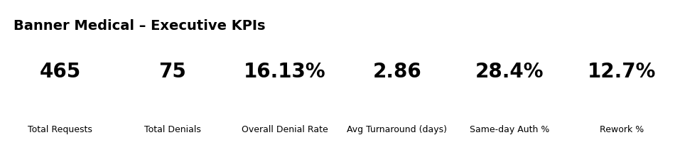
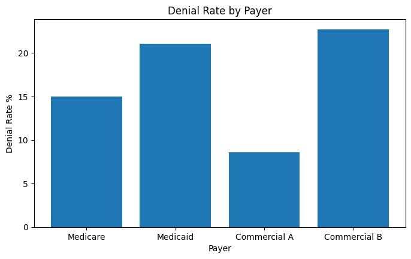
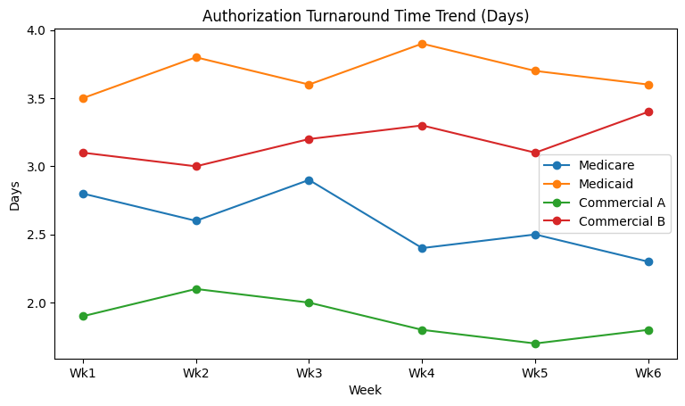
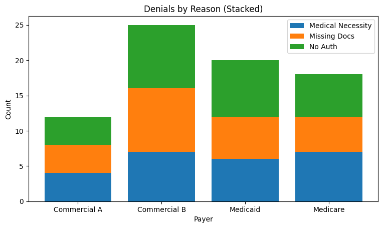
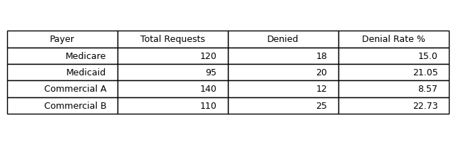

# Healthcare Analytics Portfolio  
**Revenue Cycle • Utilization Management • Data Analytics (Mock Data)**

This portfolio demonstrates how I analyze healthcare operational data to improve **patient access, authorization performance, and revenue integrity**.  
All datasets are mock data created for portfolio and interview demonstration purposes.

---

## 🔍 What This Portfolio Shows Recruiters
- Healthcare domain expertise (patient access, UM, revenue cycle)
- SQL-driven analysis translated into **business insights**
- Executive-ready **dashboards and KPIs**
- Employer-specific analytics tailored to large health systems

---

## 📊 Featured Power BI–Style Visuals

### Executive KPI Summary


**KPIs included**
- Total Requests  
- Total Denials  
- Overall Denial Rate  
- Average Turnaround Time  

---

### Denial Rate by Payer


**Insight**
Identifies payers with elevated denial risk to support targeted workflow or documentation improvements.

---

### Authorization Turnaround Time Trends


**Insight**
Tracks authorization delays over time to support patient throughput and scheduling optimization.

---

### Denials by Root Cause


**Insight**
Highlights preventable denial drivers such as missing documentation or medical necessity gaps.

---

### Payer Summary Matrix


**Insight**
Provides an executive-ready snapshot of payer performance and risk.

---

## 🏥 Employer-Specific Analytics

### 🔹 Banner Medical (Front-End Revenue Cycle)
**Focus Areas**
- Same-day Authorization %  
- Rework %  
- Authorization turnaround & throughput  

**How I’d Apply This**
- Reduce scheduling delays by improving same-day completion
- Identify payers/services driving rework
- Partner with UM and clinical teams on documentation standards

➡️ See full page: `banner.html`

---

### 🔹 Dignity Health / CommonSpirit (Revenue Integrity)
**Focus Areas**
- Avoidable Denial %  
- Documentation Completeness %  
- Compliance & audit analytics  

**How I’d Apply This**
- Segment avoidable denials by payer and service line
- Support revenue integrity and compliance initiatives
- Reduce revenue leakage through data-driven interventions

➡️ See full page: `dignity.html`

---

## 🛠 Tools & Skills Demonstrated
- **SQL:** SELECT, JOIN, GROUP BY, CASE  
- **Excel:** Dashboards, PivotTables, data validation  
- **Power BI (Design):** KPI cards, trends, matrices (mockups)  
- **Healthcare Expertise:** Authorizations, UM, denials, compliance  

---

## 📁 Repository Structure
```
├── README.md
├── index.html
├── banner.html
├── dignity.html
├── powerbi_mockups/
│   ├── pbi_kpi_cards_banner.png
│   ├── pbi_kpi_cards_dignity.png
│   ├── pbi_denial_rate_by_payer.png
│   ├── pbi_turnaround_trend.png
│   ├── pbi_denials_by_reason_stacked.png
│   └── pbi_matrix_summary.png
```

---

## 🚀 About Me
Healthcare Revenue Cycle professional with 10+ years of experience and formal education in **Computer Science (Programming & Analysis)**.  
CRCR-certified, specializing in translating healthcare operations into actionable analytics.

---

📌 *This portfolio is designed to mirror real-world healthcare analyst work and support technical and behavioral interviews.*