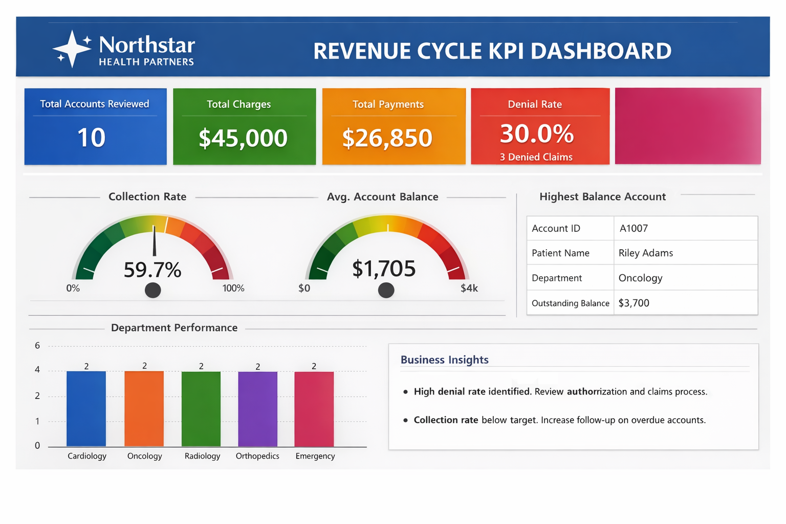

# 📊 Revenue Cycle KPI Dashboard Case Study

**Mock Organization:** Northstar Health Partners

---

## 🎯 Business Problem

Healthcare organizations need visibility into revenue performance, including:

* Denial trends
* Payment collection rates
* Department-level performance

Without clear reporting, revenue loss and inefficiencies can go unnoticed.

---

## 📸 Dashboard Preview

---

## 🔍 Key Insights

* Denial rate exceeded 25% → indicates authorization or billing issues
* Collection rate below target → opportunity to improve follow-up workflows
* Oncology and Orthopedics show highest outstanding balances

---

## 💡 Recommendations

* Improve front-end authorization processes
* Strengthen denial management workflows
* Focus on high-balance accounts for faster recovery

---

## 🛠 Tools Used

* Power BI (mock dashboard design)
* SQL (data preparation concepts)
* Healthcare domain knowledge

---

## 📈 Business Impact

This project demonstrates how data can be used to:

* Reduce denials
* Improve revenue capture
* Support leadership decision-making

---

⭐ *All data is fictional and created for portfolio purposes.*
